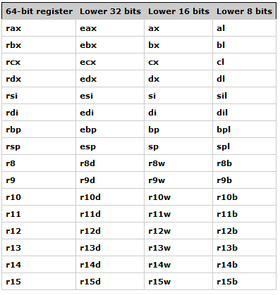

# General

[64-bit Linux stack smashing (link)](https://blog.techorganic.com/2015/04/21/64-bit-linux-stack-smashing-tutorial-part-2/)

[ROP Beginner's Guide](https://ropemporium.com/guide.html)

[GOT and PLT pwning](https://systemoverlord.com/2017/03/19/got-and-plt-for-pwning.html)

## 32bit vs 64bit
---

1. In 64-bit binaries, function parameters are passed in registers, therefore there’s no need to fake a stack frame. The first six parameters are passed in registers `RDI`, `RSI`, `RDX`, `RCX`, `R8`, and `R9`. Anything beyond that is passed in the stack.
2. The `MOVAPS` issue. You're using Ubuntu 18.04 and segfaulting on a `movaps` instruction in `buffered_vfprintf()` or `do_system()` in the 64 bit challenges then ensure the stack is 16-byte aligned before returning to GLIBC functions such as `printf()` and `system()`. The version of GLIBC packaged with Ubuntu 18.04 uses `movaps` instructions to move data onto the stack in some functions. <b>The 64 bit calling convention requires the stack to be 16-byte aligned before a call instruction</b> but this is easily violated during ROP chain execution, causing all further calls from that function to be made with a misaligned stack. `movaps` triggers a general protection fault when operating on unaligned data, so try padding your ROP chain with an extra ret before returning into a function or return further into a function to skip a push instruction.<br/>
Source: https://ropemporium.com/guide.html section: "Common Pitfalls"

## Register Layout:

<br/>

## Signal Return Oriented Programming (SROP)
---

SROP takes advantage of the `rt_sigreturn` syscall. Read bout it here:<br/>
https://amriunix.com/post/sigreturn-oriented-programming-srop/

## General Mitigations
---
1. `seccomp` library. More about it [here](https://en.wikipedia.org/wiki/Seccomp)

## Mitigations in Buffer Overflows
---

1. <i>Stack Canaries/Cookies</i>: These are known words which are placed between the buffer and the control data in order to detect a buffer overflow attack. The idea is pretty much:
```C
if(secret_on_stack == global_secret) { //or per function secret
    return;
} else {
    crash();
}
```
2. <i>ASLR (Address Space Layout Randomization)</i> - Defeated by a memory leak vulnerabilities. Effectively, randomizes starting address of stack, heap, and libraries
3. <i>DEP</i> (Otherwise known as: <i>Data Execution Prevention</i>, <i>write XOR execute</i>, <i>NX bit</i>)
4. <i>Partial RELRO</i> (enabled with `-Wl,-z,relro`) and <i>Full RELRO</i> (enabled with `-Wl,-z,relro,-z,now`). RELO stands for Relocations read-only. Read about them [here](https://systemoverlord.com/2017/03/19/got-and-plt-for-pwning.html)
    * <i>Partial RELRO</i>: `.got` section becomes read-only, but <b>*not*</b> .`got.plt`. Effectively rearranges sections to reduce the likelihood of global variables overflowing into control structures.
    * <i>Full RELO</i>: Does the same as Partial RELO, but additionally, causes the linker to resolve all external symbols at link time before execution, and then mark `.got` as read-only. `.got.plt` is merged into `.got` so you won't see this section name. In other words, it does *not* do <i>lazy binding</i>.<br/>

    Only full RELRO protects against overwriting function pointers in `.got.plt`. It works by causing the linker to immediately look up every symbol in the PLT and update the addresses, then `mprotect` the page to no longer be writable.
