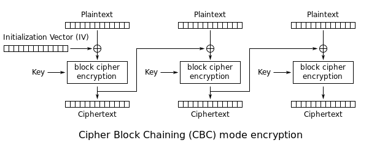
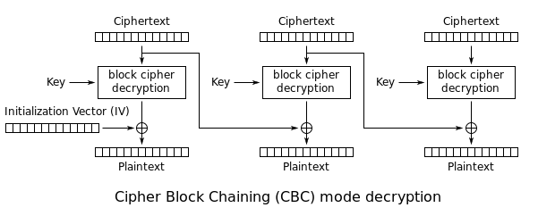
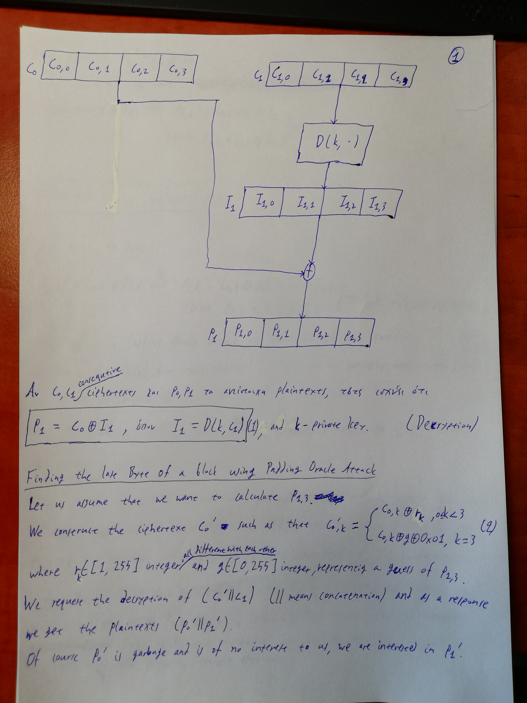
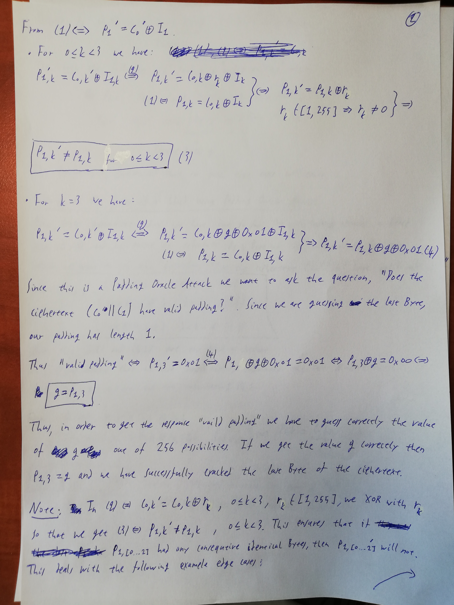
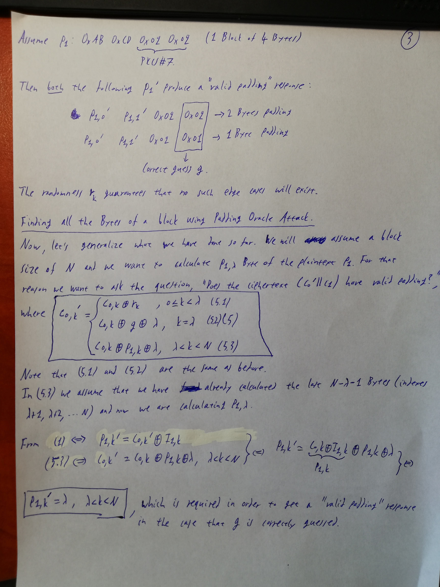

# Padding Oracle Attack

A Padding Oracle Attack is an attack that asks an Oracle about whether a ciphertext has valid padding or not. From that information the attacker tries to construct the plaintext from a ciphertext. Padding oracle attacks are mostly associated with CBC (Cipher Block Chaining) mode decryption used within block ciphers and PKCS#7 padding. In this attack we will examine a Padding Oracle Attack in AES128 CBC with PKCS#7 padding.

Notes:

* In this type of attack, the attacker cannot construct the encryption key. Instead, they construct the plaintext from a given pair of ciphertexts

## Terminology

* *Oracle* - An <i>Oracle</i> is a mechanism for determining whether a test has passed or failed. The attacker asks the Oracle something, and the Oracle as blackbox, answers with a yes or no.

## Padding

What is <i>Padding</i>? - Block ciphers encrypt data message in "blocks" of a fixed size. For instance, AES-128 treats 16-byte data as one block, and DES uses a block size of 8 bytes. If a message's length is not a multiple of the block size, then additional bytes need to be appended to the message in order for the block cipher algorithms to be able to work. These extra bytes are called <i>padding</i> and there are various algorithms that can pad and unpad data.

* *[PKCS#7 Padding Algorithm](https://tools.ietf.org/html/rfc5652#section-6.3)* - The value of each padding byte is the number of required bytes that need to be added in order for the input to reach the block size. If the input is equal to the block size, then a new block is inserted. Examples:
  * For block size 8, the input `0xAB 0xCD 0xEF 0xFF` is padded to `0xAB 0xCD 0xEF 0xFF 0x04 0x04 0x04 0x04` (1 Block)
  * For block size 2, the input `0xAB 0xCD 0xEF 0xFF` is padded to `0xAB 0xCD 0xEF 0xFF 0x02 0x02` (3 blocks)

## The Attack

### Background

#### CBC Encryption

#### CBC Decryption

#### CBC Bit Flip Property

The CBC mode has the property that after introducing a 1-bit error in a ciphertext block, decrypting the ciphertext will propagate the identical 1-bit error in the next block  (and completely scramble the block the error occurred in). In other words, if you flip the bit `N` in block `X` of the ciphertext, decrypting this corrupted ciphertext will cause block `X+1` to decrypt without any errors except that bit `N` in that block will be flipped. Finally, the error does not propagate any further.

Resources:

* [Mathematical Proof](https://crypto.stackexchange.com/questions/30172/single-bit-error-in-cbc)
* A way to calculate the Padding Bytes in PKCS#7 is described [here, under "First Step: Detecting The Padding Byte"](https://eklitzke.org/the-cbc-padding-oracle-problem), but this is not required for our attack to work

### Explanation of the Attack

### Determining the block size `N`

The most common block sizes `N` are 8, 16 or 32 Bytes, however we need to know in order to perform attack. We use trial and error

### Finding potential Padding Oracles

* Replace a byte in the last block of the ciphertext by a random value and send it to the server. Observe for error messages or even blank pages.
* Google error messages

## CBC-R Encryption

Researchers from the University of Maryland have [published](http://www.cs.umd.edu/~jkatz/security/downloads/padding-oracle-attacks.pdf) a way to convert a CBC Padding Oracle to an Encryption Oracle. This means that the attacker can use the padding oracle in order to encrypt messages of any length without the knowledge of the symmetric key.

FIXME:

## Mitigations

FIXME:

Links: (FIXME:)

https://www.exploit-db.com/docs/english/15137-practical-padding-oracle-attacks.pdf

http://www.cs.umd.edu/~jkatz/security/downloads/padding-oracle-attacks.pdf

Tools for automation: (FIXME:)

https://tools.kali.org/web-applications/padbuster
[POET - Padding Oracle Exploit Tool](http://netifera.com/research/)
