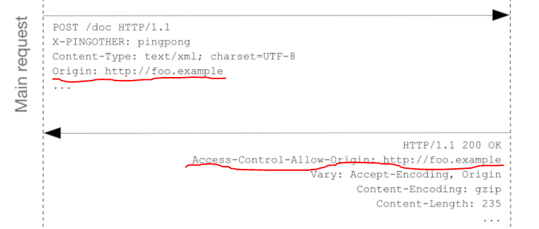

# Defenses

## Same Origin Policy (SOP)

An [Origin](https://developer.mozilla.org/en-US/docs/Glossary/Origin) is defined as scheme (protocol), host (domain), and TCP port that are part of a URL. Two objects have the same origin only when the scheme, host, and port all match.

The [Same Origin Policy (SOP)](https://developer.mozilla.org/en-US/docs/Web/Security/Same-origin_policy) defines what communication is allowed between two different origins, e.g. via `XMLHttpRequest` or ``. By default one origin cannot read data from another origin. However, one origin can still send data to another origin (e.g. via a POST request), but it won't be able to read the response (this hints towards CSRF attacks as we discuss later on).

For example, in the case bellow the SOP constraints are met and communication between the origins is not restricted.


## Cross-Origin Resource Sharing (CORS)

[Cross-Origin Resource Sharing (CORS)](https://developer.mozilla.org/en-US/docs/Web/HTTP/CORS) is a mechanism to lift the restrictions imposed by SOP between two origins. The reason is that there are services offered as APIs. Suppose a server A would like to use a service from another server B. Under SOP, any attempt to read data from the service would be blocked. So the service must include a CORS header in its response which states that A is allowed to read from my service: `Access-Control-Allow-Origin: https://server-A.com`.

Notes:

* The request from the browser that is sent to the service B on behalf of A, also includes an `Origin` header: `Origin: https://server-A.com`
* We can also allow any origin to read data: `Access-Control-Allow-Origin: *`

Example of a request with Cross-Origin Resource Sharing:



## XSS Mitigation - Content Security Policy (CSP)

[Content Security Policy (CSP)](https://developer.mozilla.org/en-US/docs/Web/HTTP/CSP) is used to mitigate XSS and data injection attacks. The server includes in each response a header `Content-Security-Policy: <policy-directive>; <policy-directive>` which controls the resources that can be loaded in the given page. For example,

```http
Content-Security-Policy: default-src 'self'; object-src 'none'; 
                         frame-src https://www.google.com/recaptcha/;
                         font-src https://fonts.gstatic.com/;
                         style-src 'self' https://fonts.googleapis.com/;
                         script-src 'self' https://www.gstatic.com/recaptcha/
```

As you can see, JavaScript is allowed only from the same origin (`self`) and from `gstatic.com`. Also, since the value `unsafe-inline` is not present, inline JavaScript (aka `<script>` tags without `src=...`) is not allowed.

Notes:

* Instead of a response header, we can also user `<meta>` tags. For example: <br/> `<meta http-equiv="Content-Security-Policy" content="default-src self">`
* In order to see how well your website is protected via CSP, you can use the online [CSP Evaluator by Google](https://csp-evaluator.withgoogle.com/)

### CORS vs CSP - What is the difference?

CORS allows a site B to give permission to site A to read (potentially private) data from site B (using the visitor's browser and credentials). (e.g. Server A can access data from service B.)

CSP allows a site to prevent itself from loading (potentially malicious) content from unexpected sources (e.g. as a defense against XSS).

## CSRF Mitigation

### CSRF Tokens - Forms

When submitting forms, we augment them with one additional field:

```html
<input type="hidden" name="csrf-token" value="CIwNZNlR4XbisJF39I8yWnWX9wX4WFoz" />
```

These tokens are generated each time the user visits the page. They are stored server-side within the user's session data. When the server receives a request from the user, it also checks the `csrf-token` value to match the stored value. Note that the attacker in the CSRF scenario does not have this token so it is impossible for him to guess it.

* There is also the alternative of per-session CSRF tokens. The token is renewed when the user logins to avoid session fixation by an attacker.

### CSRF Tokens - Headers

Sometimes, we do not submit forms but for example JSON data in a REST API. In such cases we can place the CSRF token as a **custom** header. We cannot let the browser add such a header because the problem would reoccur! So, usually through JavaScript, we add a custom header such as `X-XSRF-Header` or `X-Csrf-Token` or something similar, with value the token value.

But where does the token value come from? We use a [Cookie-to-header token](https://en.wikipedia.org/wiki/Cross-site_request_forgery#Cookie-to-header_token). The server sets the token value in a `Csrf-token` cookie and client-side we add the header manually by reading this cookie's value.
